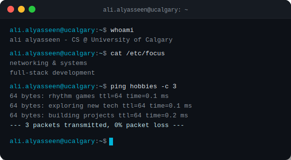
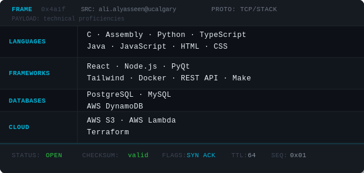

<!-- HEADER -->

  

---

<!-- ROW 1: TERMINAL + MIKU -->
<table align="center">
  <tr>
    <td align="center">
      
    </td>
    <td align="center">
      
    </td>
  </tr>
</table>

---

<!-- ROW 2: SKILLS + STATS -->
<table align="center">
  <tr>
    <td align="center">
      
    </td>
    <td align="center">
      
    </td>
  </tr>
</table>
<!-- FOOTER -->

